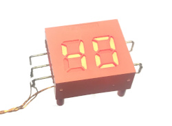

LS-3020U
========

This repository contains Python code for controlling the LS-3020U display.

LS-3020U is an LED display with two red seven-segment 0.4" (10.16mm) digits and no decimal points. The part operates at 3.3V and is accessible through an I²C interface at a fixed address 0x20. Each segment can be enabled individually and the overall display brightness can be adjusted.

The component does not appear to be available for purchase as of 2021, however, it can be found in base units of certain Panasonic landline phones (e.g. KX-TGE230 and others) where it goes by part number B3CAT0000004.

A couple of scripts are included to demonstrate possible applications of this display on a Raspberry Pi:

* `ls3020u-cputemp.py`: shows current CPU temperature. Blinks slowly if the processor is being throttled; rapidly if an undervoltage condition is detected.
* `ls3020u-ipaddr.py`: scrolls the computer's full IP address over the display.

Getting Started
---------------

The display has five pins arranged as follows (front view):

       +------------------+
    ---| 1   LS-3020U   5 |---      1 = RESET#
       |                  |         2 = SDA
    ---| 2                |         3 = 3.3V
       |                  |         4 = GND
    ---| 3              4 |---      5 = SCL
       |                  |
       +------------------+

Toggling the RESET# pin does not appear to be necessary; however, if left floating, the pin is prone to picking up noise and randomly resetting the display, so tying it to 3.3V is strongly recommended.

Included code examples assume the display is wired to I²C bus 1. Once connected, the part should appear on address 0x20:

    pi@raspberrypi:~ $ i2cdetect -y 1
        0  1  2  3  4  5  6  7  8  9  a  b  c  d  e  f
    00:          -- -- -- -- -- -- -- -- -- -- -- -- --
    10: -- -- -- -- -- -- -- -- -- -- -- -- -- -- -- --
    20: 20 -- -- -- -- -- -- -- -- -- -- -- -- -- -- --
    30: -- -- -- -- -- -- -- -- -- -- -- -- -- -- -- --
    40: -- -- -- -- -- -- -- -- -- -- -- -- -- -- -- --
    50: -- -- -- -- -- -- -- -- -- -- -- -- -- -- -- --
    60: -- -- -- -- -- -- -- -- -- -- -- -- -- -- -- --
    70: -- -- -- -- -- -- -- --

To test the display, run the script below, which will show a counting up animation with a fade out effect at the end:

    $ ./ls3020u-test.py

Usage
-----

The `LS3020U` class provides several methods for interfacing with the part. To begin using the display, instantiate the class with an appropriate SMBus; the constructor will immediately clear the display, reset its state, and set its brightness to maximum.

    from ls3020u import LS3020U
    import smbus
    d = LS3020U(smbus.SMBus(1))

Segment patterns for printable text characters can be defined using the optional `customFont` argument to the constructor. The font is provided as a dictionary, where a key indicates the character and a value is an integer where bits represent individual segments as 0bGFEDCBA.

    d = LS3020U(smbus.SMBus(1), customFont={'I': 0b0000110, 'P': 0b1110011})

There are three methods provided for displaying content. `printText()` prints a string using the available character patterns and any unused space will be left blank.

    d.printText('-1') # "-1"
    d.printText('-')  # "- "
    d.printText('')   # "  "

`printHex()` prints a hexadecimal number between 0x00 and 0xff.

    d.printHex(0)    # "00"
    d.printHex(0xa)  # "0A"
    d.printHex(0xab) # "AB"

`printSegments()` displays arbitrary segment patterns, which are represented as a list of integers representing segments in the 0bGFEDCBA format. Any digits for which this list does not specify a pattern will be left blank.

    d.printSegments([0b0111001, 0b0001111]) # "[]"
    d.printSegments([0b1101101])            # "[ "
    d.printSegments([])                     # "  "

Segment brightness can be adjusted by calling the `setIntensity()` method with the requested brightess given as a number between 0.0 and 1.0, for example:

    d.setBrightness(0.7)

Experimental Features
---------------------

The display contains a hardware hex decoder that can be activated via the `setHexMode(True)` call. `printHex()` will use this mode if it's enabled, however the performance benefit of doing so is virtually insignificant. Calling `printText()` or `printSegments()` will automatically switch the display back to direct segment access mode.

The number of bus transfers can be reduced by activating the auto-refresh feature using `setAutoRefresh(True)`. This mode allows updated content to appear on the display as soon as it's written, without requiring an additional write to the refresh register.

License
-------

Copyright 2021 Vladimir Porokhin

Permission is hereby granted, free of charge, to any person obtaining a copy of this software and associated documentation files (the "Software"), to deal in the Software without restriction, including without limitation the rights to use, copy, modify, merge, publish, distribute, sublicense, and/or sell copies of the Software, and to permit persons to whom the Software is furnished to do so, subject to the following conditions:

The above copyright notice and this permission notice shall be included in all copies or substantial portions of the Software.

THE SOFTWARE IS PROVIDED "AS IS", WITHOUT WARRANTY OF ANY KIND, EXPRESS OR IMPLIED, INCLUDING BUT NOT LIMITED TO THE WARRANTIES OF MERCHANTABILITY, FITNESS FOR A PARTICULAR PURPOSE AND NONINFRINGEMENT. IN NO EVENT SHALL THE AUTHORS OR COPYRIGHT HOLDERS BE LIABLE FOR ANY CLAIM, DAMAGES OR OTHER LIABILITY, WHETHER IN AN ACTION OF CONTRACT, TORT OR OTHERWISE, ARISING FROM, OUT OF OR IN CONNECTION WITH THE SOFTWARE OR THE USE OR OTHER DEALINGS IN THE SOFTWARE.
